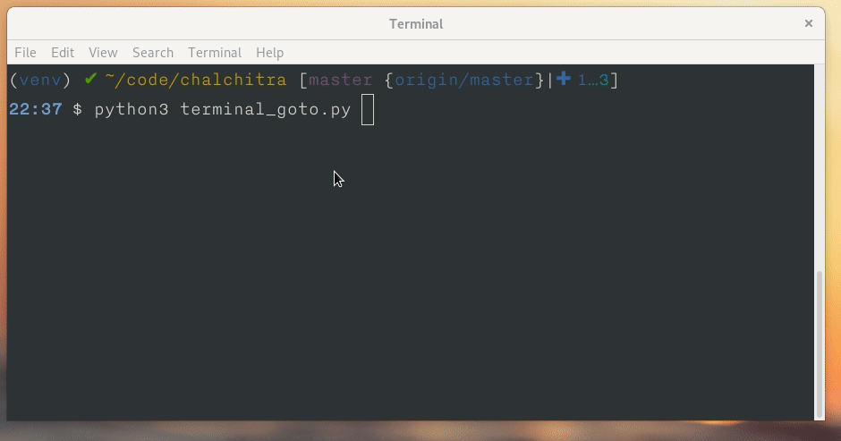
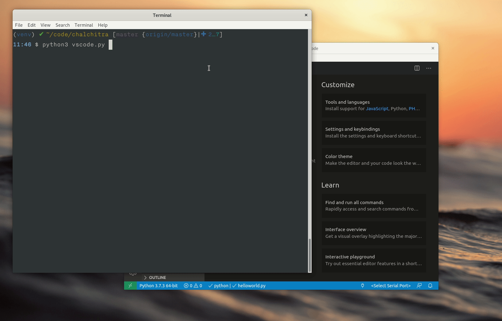
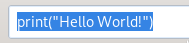
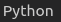
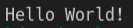
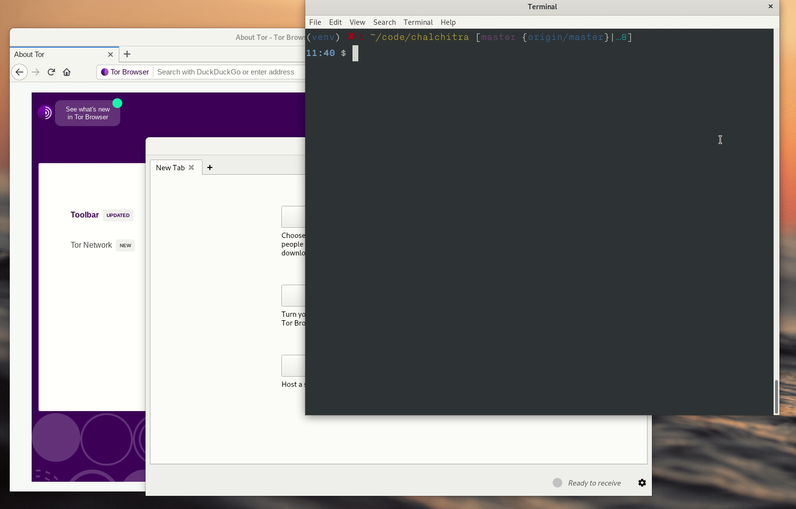
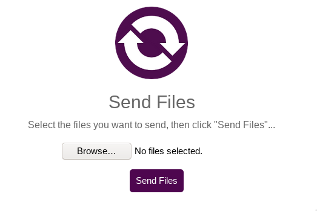
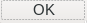
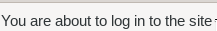

Usage
======

All functions from the library is starting with **a_**, this way you can still
easily use *pyautogui* inside your code if you want to.

Example to open a new tab in the terminal
------------------------------------------

In the following example, we open a new tab in the Gnome terminal, and then go to the */tmp* directory.
As we are not using any screenshot here, we skip the *a_setup* call.

::

    import time
    from chalchitra import *

    def goto_path(path=""):
        a_hotkey(["ctrl", "shift", "t"])
        time.sleep(0.5)
        a_typetext("cd {}".format(path))
        a_keypress("enter")

    if __name__ == "__main__":
        goto_path("/tmp")

In the `goto_path` function, first we are pressing a hotkey combination, the keys are passed into the
*a_hotkey* function as a list. Then we wait for 0.5 seconds for the terminal tab to open, and then
type the command using *a_typetext* function call. Finally using the *a_keypress* function we press the
`enter` key in the keyboard.

If you want to see all the keys you can use in *a_keypress* or *a_hotkey*,
below is the list (stored in the *KEYS* variable).

::

    ['\t', '\n', '\r', ' ', '!', '"', '#', '$', '%', '&', "'", '(', ')', '*', 
    '+', ',', '-', '.', '/', '0', '1', '2', '3', '4', '5', '6', '7', '8', '9', 
    ':', ';', '<', '=', '>', '?', '@', '[', '\\', ']', '^', '_', '`', 'a', 'b', 
    'c', 'd', 'e', 'f', 'g', 'h', 'i', 'j', 'k', 'l', 'm', 'n', 'o', 'p', 'q', 
    'r', 's', 't', 'u', 'v', 'w', 'x', 'y', 'z', '{', '|', '}', '~', 'accept', 
    'add', 'alt', 'altleft', 'altright', 'apps', 'backspace', 'browserback', 
    'browserfavorites', 'browserforward', 'browserhome', 'browserrefresh', 
    'browsersearch', 'browserstop', 'capslock', 'clear', 'convert', 'ctrl', 
    'ctrlleft', 'ctrlright', 'decimal', 'del', 'delete', 'divide', 'down', 'end', 
    'enter', 'esc', 'escape', 'execute', 'f1', 'f10', 'f11', 'f12', 'f13', 'f14', 
    'f15', 'f16', 'f17', 'f18', 'f19', 'f2', 'f20', 'f21', 'f22', 'f23', 'f24', 'f3', 
    'f4', 'f5', 'f6', 'f7', 'f8', 'f9', 'final', 'fn', 'hanguel', 'hangul', 'hanja', 
    'help', 'home', 'insert', 'junja', 'kana', 'kanji', 'launchapp1', 'launchapp2', 
    'launchmail', 'launchmediaselect', 'left', 'modechange', 'multiply', 'nexttrack', 
    'nonconvert', 'num0', 'num1', 'num2', 'num3', 'num4', 'num5', 'num6', 'num7', 'num8', 
    'num9', 'numlock', 'pagedown', 'pageup', 'pause', 'pgdn', 'pgup', 'playpause', 'prevtrack', 
    'print', 'printscreen', 'prntscrn', 'prtsc', 'prtscr', 'return', 'right', 'scrolllock', 
    'select', 'separator', 'shift', 'shiftleft', 'shiftright', 'sleep', 'space', 'stop', 
    'subtract', 'tab', 'up', 'volumedown', 'volumemute', 'volumeup', 'win', 'winleft', 
    'winright', 'yen', 'command', 'option', 'optionleft', 'optionright']

Screenshot matching and using mouse
------------------------------------

The following functions and examples take help of matching screenshots and using the mouse to click on the 
different elements on the screen.

Call a_setup first
++++++++++++++++++

In every code base, remember to call `a_setup` (if you are using screenshots) to
verify or do mouse clicks on the items on the screen. The function takes one
argument, the directory path where we store the screenshots for the project.

::

    a_setup("images")

Right now there are two different mouse click functions available. *a_click*
and *a_doubleclick*. Both the functions take an image name (screenshot) as the
first argument, if it can find the image on the screen, then it clicks on the
center (of the image). If the image was found and then clicked, then the
function returns `True` or else `False`.

After every mouse click, we should wait for some time so that screen redraws
itself (think when you are saving a file, and the filename showsup somewhere
in the screen). We can use `time.sleep` calls for the same.

Similarly one can call *a_verify* function to verify if an image (screenshot)
can be found on the screen. This way we can verify the state of the
application we are testing.

VS Code and Python code execution example
------------------------------------------

In the following example, the code presses `Alt+Tab` to go the VS Code window,
then creates a new file, then types in the Python source code. Then it saves
the file with the name *helloworld.py*, then presses `Ctrl+F5` to execute the
file. Because the developer's setup of the VS Code, it also has to select
which Python environment to use.

::

    import time
    from chalchitra import *

    def main():
        a_setup("parts/vscodepy")

        # Click on the new file
        assert a_click("newfile")
        time.sleep(0.5)
        # Type our code
        a_typetext('print("Hello World!")')
        # Save the file
        a_hotkey(["ctrl", "s"])
        time.sleep(0.5)
        # type the filename
        a_typetext("helloworld.py")
        # Press Enter
        a_keypress("enter")
        time.sleep(1)
        # Now verify that the file saved with the correct filename
        assert a_verify("correct_filename")

        # Execute the code
        a_hotkey(["ctrl", "f5"])
        time.sleep(0.5)
        # Because I have two different environment in my VS Code setup, I will
        # have to select Python
        assert a_click("python_env")
        time.sleep(0.5)
        # verify that the correct output is the screen
        # reduced the confidence to make sure if finds properly.
        assert a_verify("output", confidence=0.7)

    if __name__ == "__main__":
        # sleep for 1 second for the screencast recording
        time.sleep(1)
        # Move to the VS Code window
        a_hotkey(["alt", "tab"])
        time.sleep(0.5)
        main()

You will notice that in the final `a_verify` call we are also passing the confidence value.

Below are the example screenshots used in the above code to match:

Receive file via OnionShare
---------------------------

In this example, we wil use the `OnionShare <https://onionshare.org>`_ tool to
receive a file, we will use `Tor Browser <https://www.torproject.org>`_ to do
the actual upload.

The code is given below

::

    import time
    from chalchitra import *

    def main():
        a_setup("parts/onionshare")

        # Click on the new file
        assert a_click("receive_files")
        time.sleep(0.5)
        # Start receiving
        assert a_click("start_receiving")

        # wait for 10 seconds
        time.sleep(10)
        # copy the address
        assert a_click("copy_address")

        # Next 4 lines are to move to Tor Browser
        a_keydown("alt")
        a_keypress("tab")
        a_keypress("tab")
        a_keyup("alt")

        # Sleep for the screencast
        time.sleep(0.5)
        assert a_click("tor_browser_urlbox", confidence=0.8)
        a_hotkey(["ctrl", "v"])
        time.sleep(1)
        a_keypress("enter")
        # Now we have to wait as it will go over Tor
        time.sleep(10)
        assert a_verify("youarelogin")

        # Login to the site
        assert a_click("okbutton")
        # Wait again to load the page
        time.sleep(10)
        assert a_verify("looks_good_page")
        # Click on the Browse button to select
        assert a_click("browse_button")
        time.sleep(1)
        a_keypress("enter")
        time.sleep(1)
        assert a_click("send_files")
        # Now can you add code to verify if the upload is successful via file browser?

    if __name__ == "__main__":
        # sleep for 1 second for the screencast recording
        time.sleep(1)
        # Move to the VS Code window
        a_hotkey(["alt", "tab"])
        time.sleep(1)
        main()

The screenshots are below:

